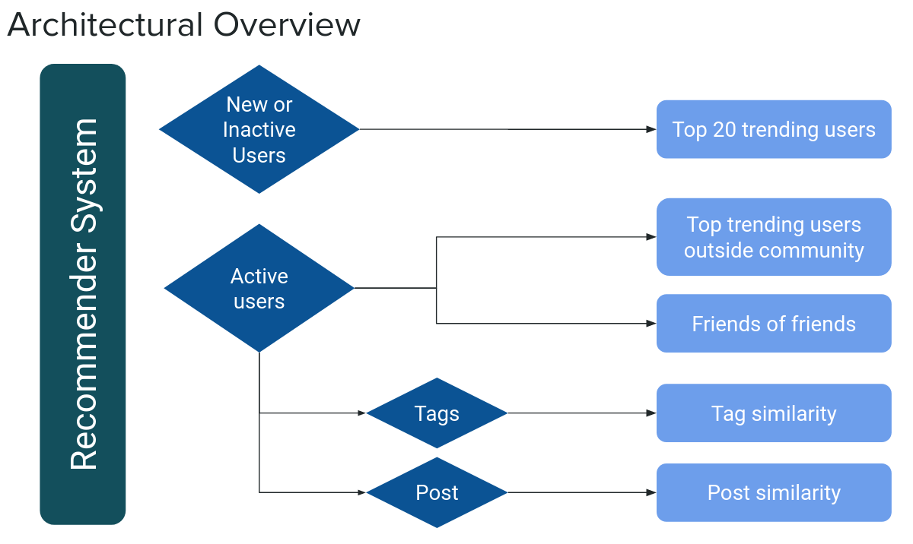

# NEAR Recommender System

**Index**

1. [NEAR Social](#near-social)
2. [Documentation](#documentation)
3. [Introduction](#introduction)
4. [Task](#task)
5. [Result](#result)
6. [Technical details](#technical-details)
7. [Methodologies](#methodologies)
   - [SQL queries](#sql-queries)
   - [Notebooks](#notebooks)
8. [Widget](#widget)
9. [Visualization](#visualization)
10. [Authors](#authors)

This repository contains the files used for the Capstone Project "NEAR Social Recommender - A recommender system for an on-chain social network" of the Data Science Bootcamp , Batch 03/2023 at Constructor.

This project was done in collaboration with [Pagoda](https://www.pagoda.co/), a software development company behind the NEAR Blockchain Operating System.

## NEAR Social

## Documentation

(Documentation)[https://scopalaffairs.github.io/near_recommender/]

### Introduction

NEAR Social is a blockchain-based social network where users log in with their NEAR wallet address. All user actions, such as posting, following, liking, and updating their profile, are recorded on the public ledger as blockchain transactions. Users own their data, and developers can create permissionless open-source apps, known as widgets, to expand the platform's capabilities.

### Task

Our objective was to develop a user recommendation system that fosters network growth by connecting users with similar interests. To achieve this, we designed a system that utilizes on-chain data for each user. We employed four distinct recommendation algorithms, as illustrated in the architectural overview below:

- Top trending users
- Friends of friends
- Tag similarity 
- Post similarity

### Result

This recommender system is available through a widget on [near.org](https://near.org/)

## Technical details

This project used the on-chain data on the NEAR blockchain via the Databricks instance of Pagoda. We created SQL queries and tables as well as Data Science Notebooks.

## Methodologies

Among others, we explored the given datasets with the following methods:

- Friends of friends
  - XGBoost
  - RandomForest
- Trending users
  - NetworkX
  - Louvain community detection
- Tag/Post Similarity
  - Natural Language Processing, Cosine Similarity
  - Pooled word embeddings on Large Transformer Model, Cosine Similarity

### SQL queries

We created our own SQL tables using existing parsed tables to process the data to our needs. These tables include:

- **near_social_txs_clean**: transactions within the social.near contract without duplicates
- **graph_follows**: table showing users and follows in the form of graph edges
- **users_agg_metrics**: account and social network metrics by user

These tables can be found in the `sit` schema inside Databricks.

### Notebooks

Several notebooks inside and outside Databricks have been created to implement the different recommender algorithms. These can be found under `near_recommender/notebooks` inside this repository.

## Widget

The recommender system is going to be implemented as a widget.

## Visualization

Unveiling the web of network connections and community clusters, several iterations of visual interfaces gave us a comprehensive understanding of user relationships, facilitating trending user recommendations and fine tuning the models.

### Authors

[Agustin Rojo Serrano](https://www.linkedin.com/in/rojoserrano/)

[Christian Kühner](https://www.linkedin.com/in/christian-k%C3%BChner-9295301b1/)

[Daniel Herrmann](https://www.linkedin.com/in/daniel-herrmann/)
