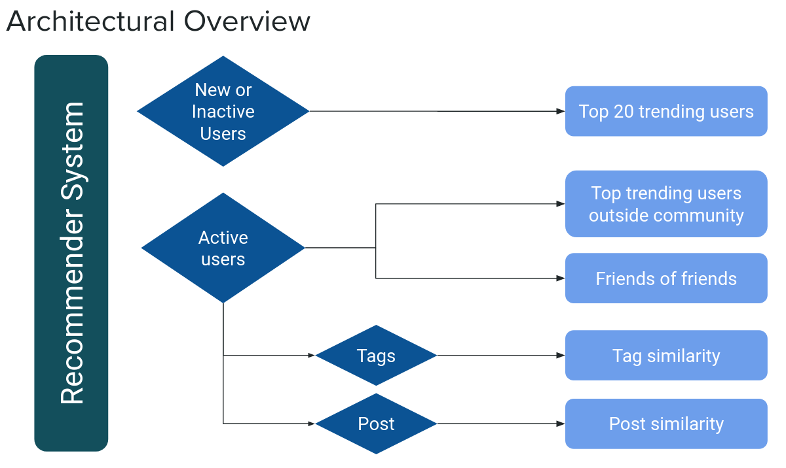

# NEAR Recommender System

This repository contains the files used for the Capstone Project "NEAR Social Recommender - A recommender system for an on-chain social network" of the Data Science Bootcamp , Batch 03/2023 at Constructor.

This project was done in collaboration with [Pagoda](https://www.pagoda.co/), a software development company behind the NEAR Blockchain Operating System.

### Authors
[Christian Kühner](https://www.linkedin.com/in/christian-k%C3%BChner-9295301b1/), [Daniel Herrmann](https://www.linkedin.com/in/daniel-herrmann/), [Agustin Rojo Serrano](https://www.linkedin.com/in/rojoserrano/)

## NEAR Social

### Introduction

NEAR Social is a social network that is developed on the NEAR Blockchain where users log in using their NEAR wallet address. Every action they take (post, follows, likes or profile updates) is broadcasted as a blockchain transaction and saved in the public ledger. The data belongs to the users and developers can create open-source apps called widgets to extend the platform's functionality in a permissionless way.

### Task

Our task was to create a user recommendation system that would enable users to connect with similar minded people and make the network grow. For that, we had to design a system that took into account the different on-chain data available for each user. We used 4 different recommendation algorithms following the architectural overview below:

- Top trending users
- Friends of friends
- Tag similarity 
- Post similarity

### Result

This recommender system is available through a widget on [near.org](https://near.org/)

## Technical details

This project used the on-chain data on the NEAR blockchain via the Databricks instance of Pagoda. We created SQL queries and tables as well as Data Science Notebooks.

### SQL queries

We created our own SQL tables using existing parsed tables to process the data to our needs. These tables include:

- **near_social_txs_clean**: transactions within the social.near contract without duplicates
- **graph_follows**: table showing users and follows in the form of graph edges
- **users_agg_metrics**: account and social network metrics by user

These tables can be found in the `sit` schema inside Databricks.

### Notebooks

Several notebooks inside and outside Databricks have been created to implement the different recommender algorithms. These can be found under `near_recommender/notebooks` inside this repository.

## Widget

The recommender system has been implemented as a widget. This can be found under `widget_name`
