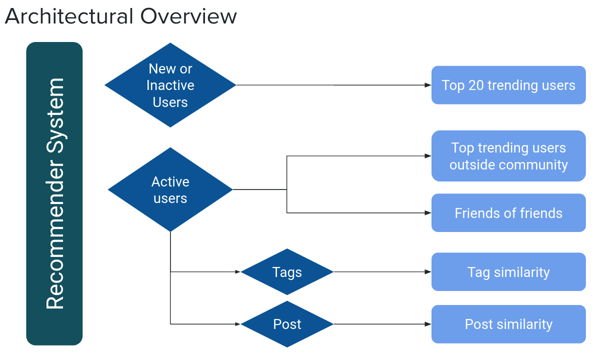

Architecture
=====================================

This section describes the overall architecture of the recommender system, including the flow of data and the different recommendation algorithms utilized.

Our objective was to develop a user recommendation system that fosters network growth by connecting users with similar interests. To achieve this, we designed a system that utilizes on-chain data for each user. We employed four distinct recommendation algorithms, as illustrated in the architectural overview below:

- Top trending users
- Friends of friends
- Tag similarity 
- Post similarity

